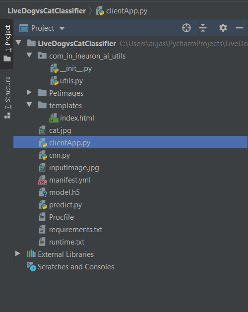
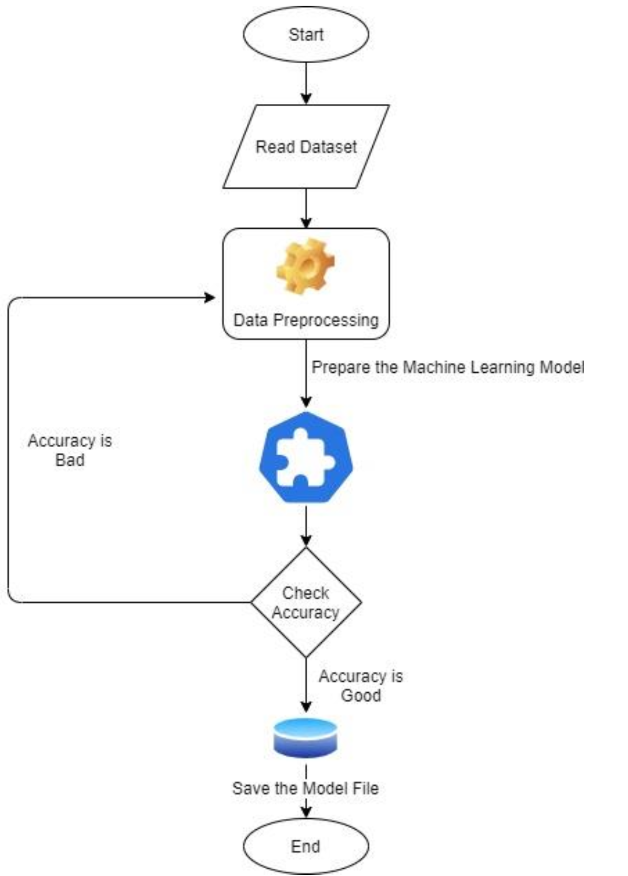
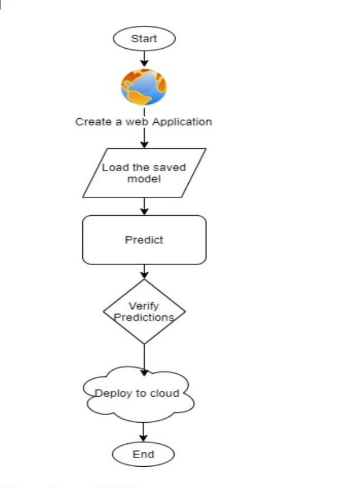
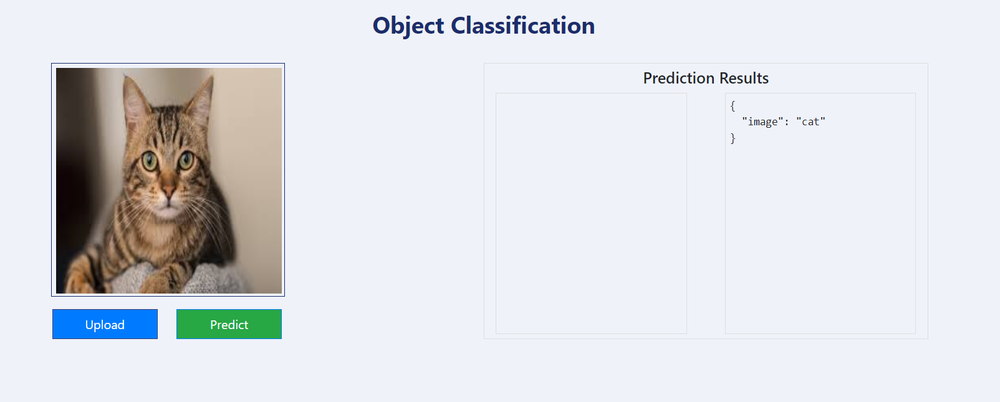

# Image Classification using Flask python web app on Pivotal Cloud Foundry Platform  

The repo comprises of training CNN from Petimages and using Flask for model serving.

## Application Pipeline 

### Training

The training pipeline includes data-preprocessing, selecting the right algorithm for creating the Machine Learning / Deep Learning model, checking the accuracy of the created model and then saving the model file. (Here, it's model.h5 file)

[Training Notebook file](cnn.py)

### Model Serving on Flask using Pivotal Cloud Foundry Services 
Once the training is done and predictions are made, the trained and saved model is exposed as an API to the user on cloud platform. 

 

## Pre-requisites
- Basic knowledge of flask framework
- Python IDE (Using PyCharm) 
- A Pivotal Account 
- Basic understanding of HTML 

## Result (After Deployment) 

